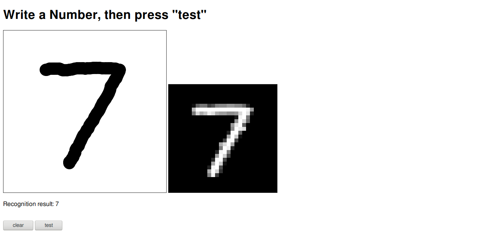
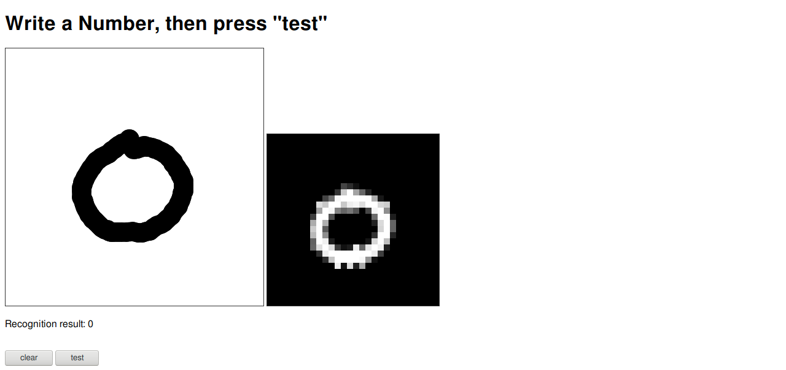
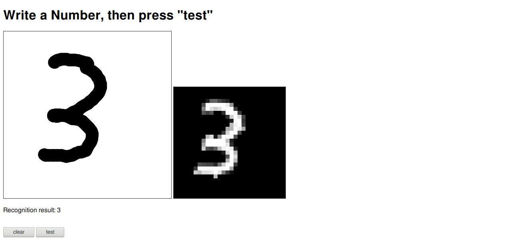

# 手写数字识别

在网页上手写数字，发送图片数据到后端，用 WASM 中运行的 Rust 代码进行图像识别。

运行本项目需要 Node.js、SSVM 和 Rust 工具链，建议按照 <https://www.secondstate.io/articles/get-started-with-rust-functions-in-node-zh/> 配置。

运行方法：

```sh
$ npm i express # 安装 express 框架
$ ssvmup build
$ node node/app.js
```

然后可通过 8080 端口访问网页。

使用截图：






